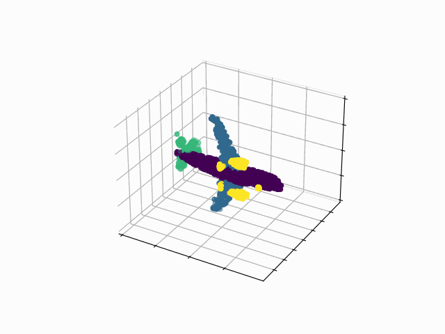
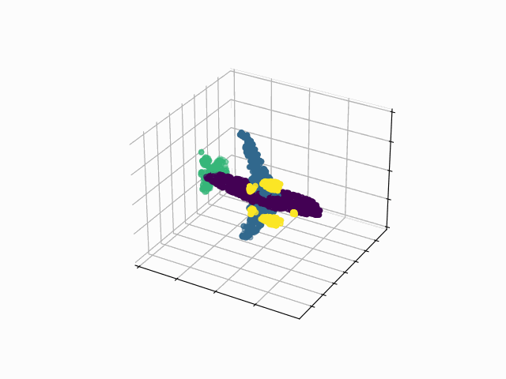
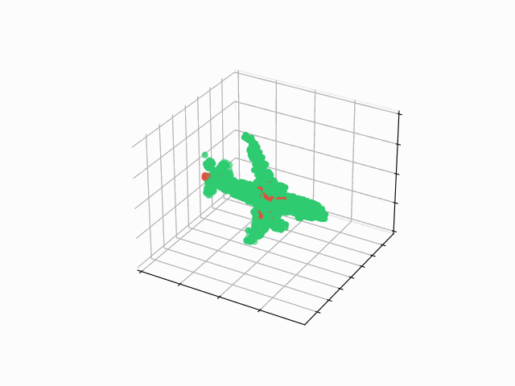
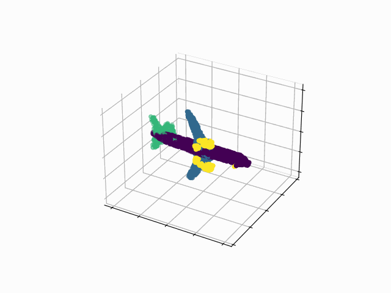
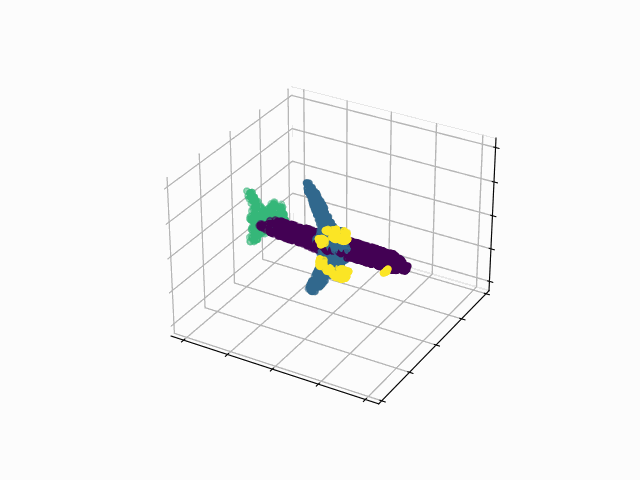
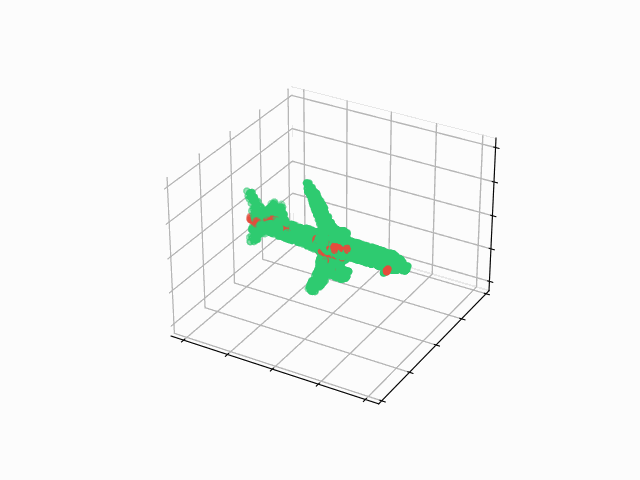
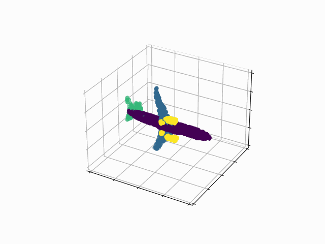
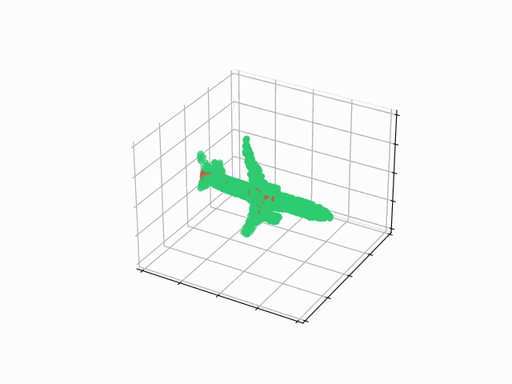

# PointNet Segmentation

<table>
    <thead>
        <tr>
            <th style="text-align: center;">Ground Truth</th>
            <th style="text-align: center;">Predicted</th>
            <th style="text-align: center;">Diff.</th>
        </tr>
    </thead>
    <tr>
        <td></td>
        <td></td>
        <td></td>
    </tr>
    <tr>
        <td></td>
        <td></td>
        <td></td>
    </tr>
    <tr>
        <td></td>
        <td></td>
        <td></td>
    </tr>
</table>